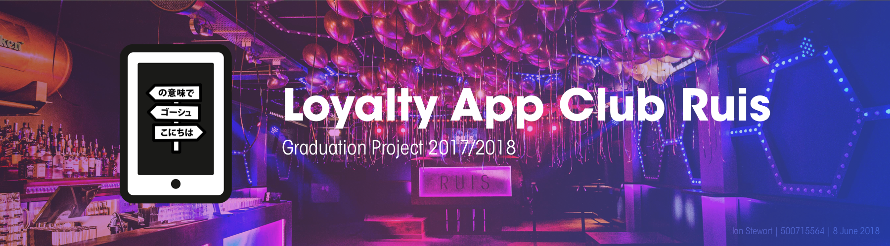

# Design Rationale

Design Rationale voor Club Ruis Loyalty app. In dit document belicht ik de belangrijkste keuzes tijdens mijn project.

#### Docent
* Harold Konickx
* [h.h.g.konickx@hva.nl](h.h.g.konickx@hva.nl)

#### Student
* Ian Stewart
* 500715564
* [ian.c.stewart@icloud.com](ian.c.stewart@icloud.com)

#### Bedrijf
* Club Ruis
* Smedestraat 31
* Haarlem

#### Download
* [Download deze site in .pdf formaat](https://www.gitbook.com/download/pdf/book/iancstewart/graduation-project-design-rationale)
* [Download deze site in .epub formaat](https://www.gitbook.com/download/epub/book/iancstewart/graduation-project-design-rationale)
* [Download deze site in .mobi formaat](https://www.gitbook.com/download/mobi/book/iancstewart/graduation-project-design-rationale)
