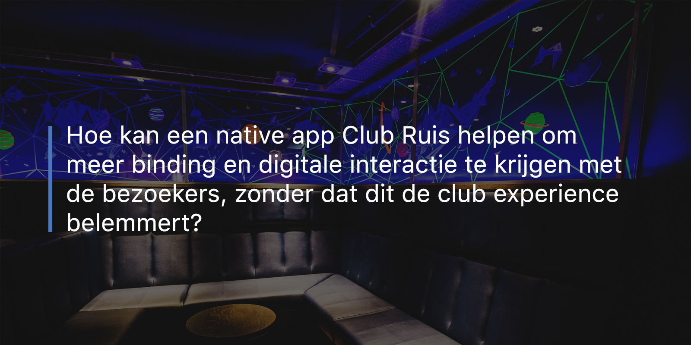

# Design Challenge

Aan de hand van de probleem situatie heb ik de volgende design challenge geformuleerd:

> Hoe kan een native app Club Ruis helpen om meer binding en digitale interactie te krijgen met de bezoekers, zonder dat dit de club experience[1] belemmert?

[1] De club experience is de ervaring die de gasten hebben terwijl zij aanwezig zijn in de club. Dit houdt in; gezellig met vrienden een drankje en een dansje doen. Hierbij zal de gast zich minder bewust zijn van zijn telefoon zodat deze op kan gaan in het moment.
