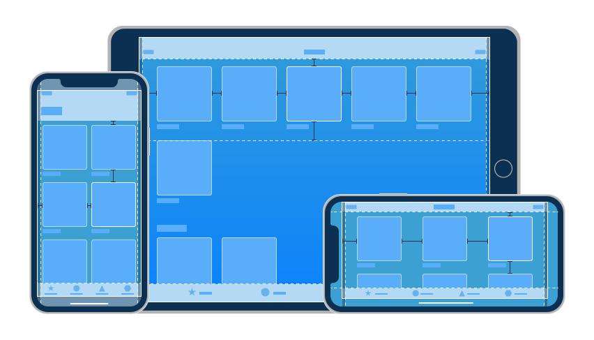

# Design Guidelines

> Parke (2016) Concludeert: At first native and web browser designs seem very similar. Many good design practices and principles from the web apply to native mobile apps — but there are key differences.

Als we Het hebben over native app design is het heel belangrijk om de design guidelines voor het desbetreffende platform te volgen. Door deze guidelines te volgen is de app niet alleen native maar ziet en voelt de app dit ook. De guidelines worden net als de platforms in twee kampen verdeeld dit zijn [Material Design](https://material.io/guidelines/material-design/introduction.html) voor Android en [Human Interface Guidelines](https://developer.apple.com/ios/human-interface-guidelines/overview/themes/) (HIG) voor iOS. In deze guidlines word uitvoerig besproken wat wel en niet kan.

## Welke guidelines
Ik heb er uiteindelijk voor gekozen om één van de twee guidelines te volgen. Hier heb ik voor gekozen om te zorgen dat de balans tussen onderzoeken, ontwerpen en bouwen van de app gelijk bleef. Bij het ontwerpen voor twee platforms was ik in de ontwerp fase veel tijd kwijt geraakt. Hiernaast gaf het ook meer ruimte om goed te focussen op één set guidelines.

> Every app from the operating system follows more or less the platform guidelines, which means that people are used to a set of design concepts as they experience them every time they do something on their device. By reusing these same concepts, you ensure that your users will know how to start using your app. ~ Fogel (2016)

Ik heb gezoken om de HIG guidelines te volgen tijdens mijn project. Dit omdat deze guidelines voor mij meer voor de hand liggen. Ik heb zelf iOS devices en heb er daardoor ook meer affiniteit voor.

