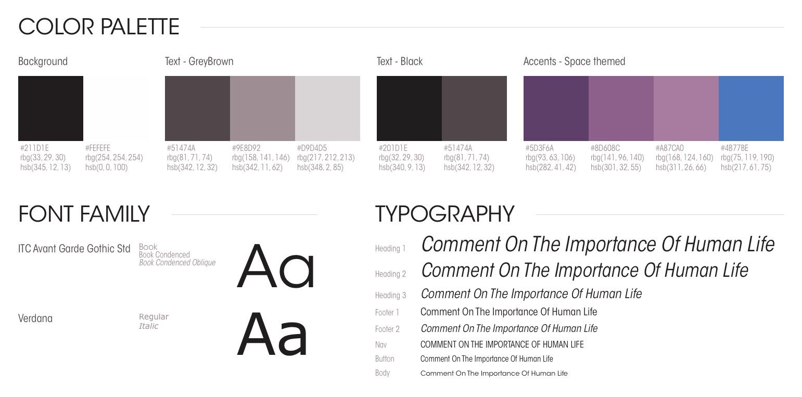
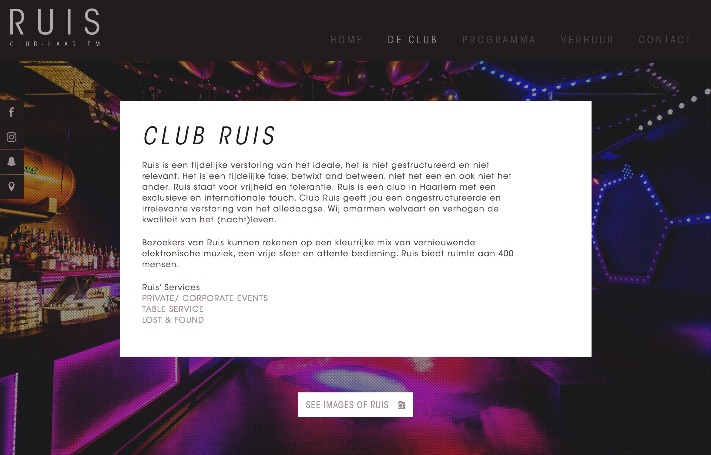
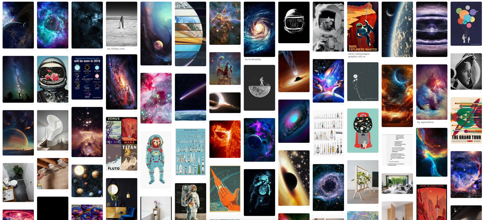

# Style Guide

Één van de requirements was om de app te ontwerpen in de huistijl van Club Ruis. Naast deze requirement van de opdrachtgever, verwachte de doelgroep een ontwerp die een premium look & feel heeft.

Om tot een correcte style guide heb ik de site van Club Ruis bestudeert. Club Ruis heeft momenteel een 'space' thema gecombineerd met een aantal standaard kleuren. Na aanleiding van mijn visueel onderzoek heb ik de ondervindingen gecombineerd tot een style guide. Deze heb ik voor de rest van mijn project gebruikt om kleur en font bepalingen te maken.

## Kleuren

### Achtergrond kleur
Hierbij is gekeken wat de voorkomende achtergrond kleuren waren op http://www.clubruis.nl. Op veel plekken word er een afbeelding gebruikt als achtergrond. Op plekken waar tekst staat word momenteel 1 van de twee kleur codes gebruikt #211D1E of #FEFEFE.

### Text
Bij de tekst kleuren zijn er twee varianten te vinden op de site. Dit zijn een grijsbruine variant en een zwarte variant. De zwarte varient is bedoeld voor op lichtere achtergronden en de hrijsbruine op donkere.

### Thema
Voor het thema heb ik gekeken wat de meest voorkomende kleuren in 'space' foto's. Hierbij is de kleur paars de prominente kleur. Naast paars is blauw een veel voorkomende kleur.

