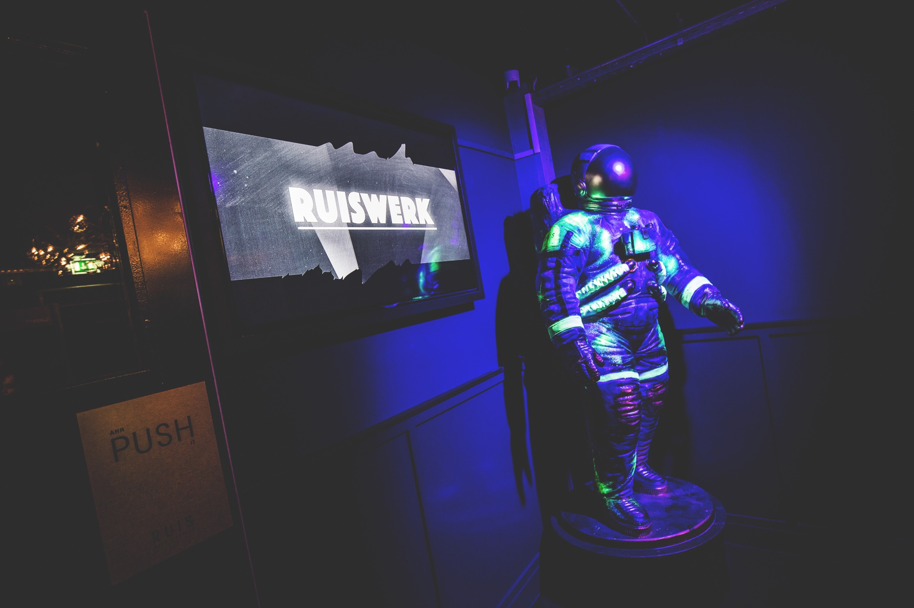

# Club Ruis

Club Ruis is een Haarlemse club die er om bekend staat een kleurrijke mix van vernieuwende elektronische muziek en een vrije sfeer. De bezoekers die hier binnen komen kunnen van *"een tijdelijke fase, betwixt and between, niet het een en ook niet het ander genieten"* aldus Club Ruis (z.d.). Club Ruis bestaat onder tussen 4 jaar en weet nog steeds hun, dan wel wat kleinere zaal in de smedestraat, nog steeds te vullen. Club Ruis zal bij sommigen mensen beter bekend staan als 023. Dit is hoe de club hete voor de naamsverandering. De club straalt een premium look en feel uit door het gebruik van leer en gebeitst hout. Deze look en feel is goed afgestemd op de bezoekers die zich zelf ook premium kleedt en gedraagt.

> Ruis is een tijdelijke verstoring van het ideale, het is niet gestructureerd en niet relevant. Het is een tijdelijke fase, betwixt and between, niet het een en ook niet het ander. Ruis staat voor vrijheid en tolerantie. Ruis is een club in Haarlem met een exclusieve en internationale touch. Club Ruis geeft jou een ongestructureerde en irrelevante verstoring van het alledaagse. Wij omarmen welvaart en verhogen de kwaliteit van het (nacht)leven.
>
> Bezoekers van Ruis kunnen rekenen op een kleurrijke mix van vernieuwende elektronische muziek, een vrije sfeer en attente bediening. Ruis biedt ruimte aan 400 mensen. ~ Club Ruis (z.d.)
