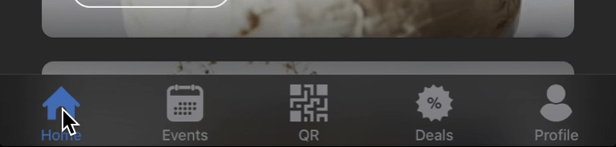
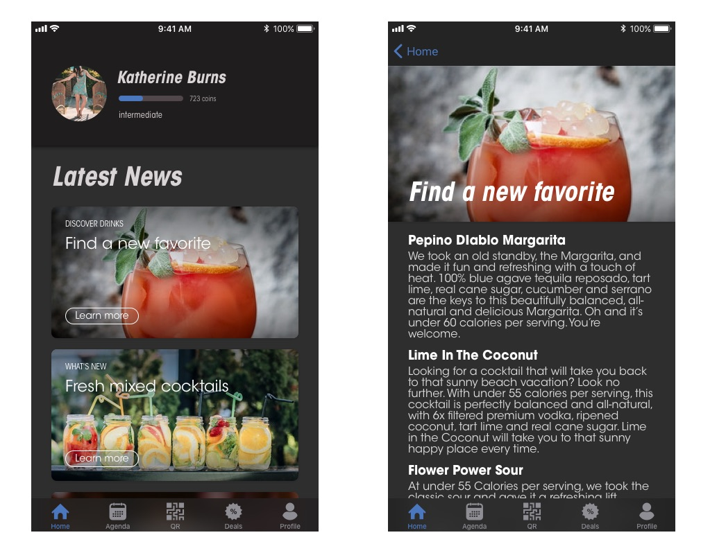
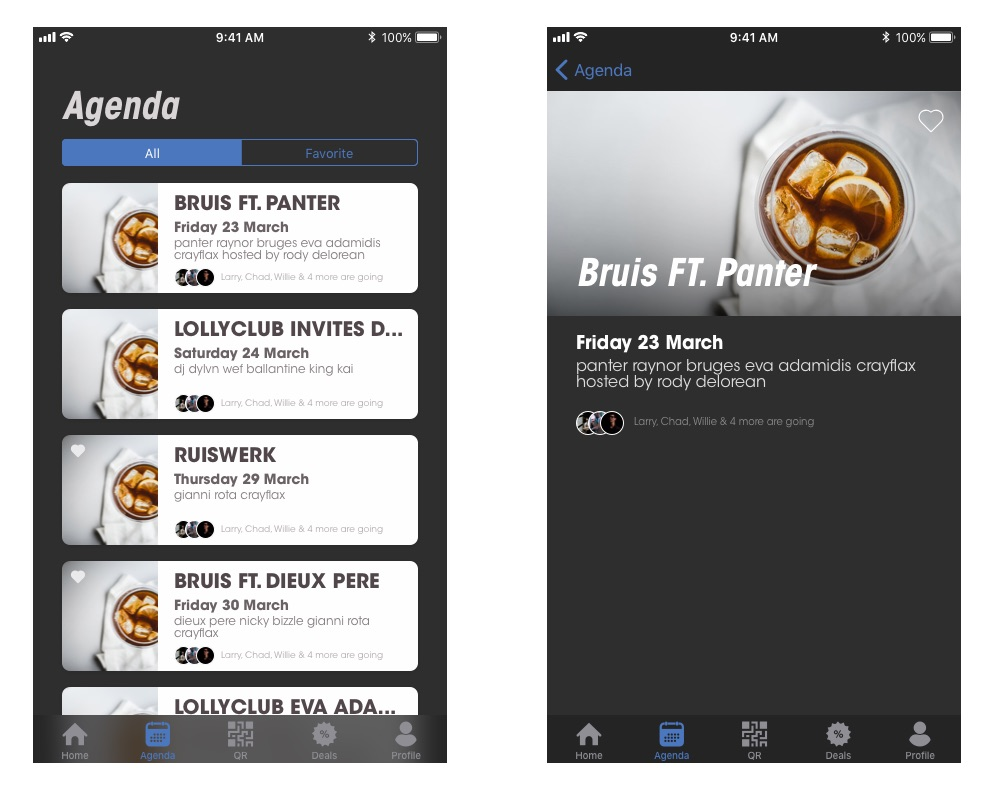
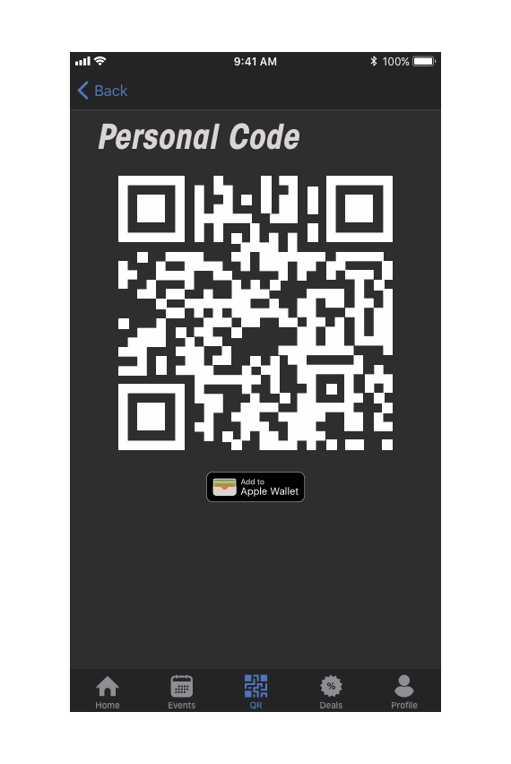
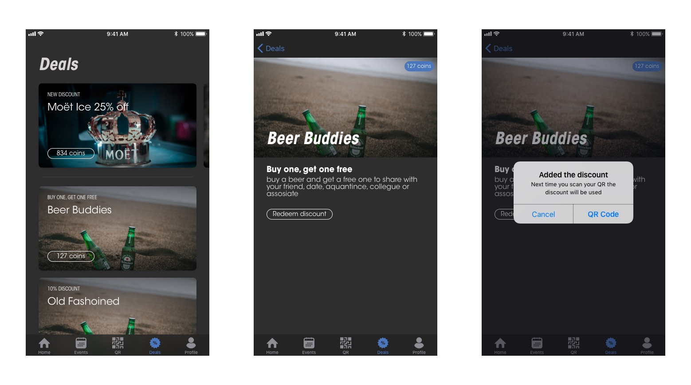
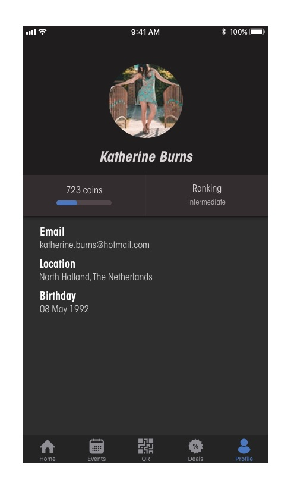

# App Flow

Om de app overzichtelijk te houden heb ik er voor gekozen om de app op te splitsen in vijf views.

- Home
- Events
- QR
- Deals
- Profile

Zoals hierboven zichtbaar is kan de gebruiker tussen deze 5 views switchen door middle van een tab navigatie. Hiermee is alle functionaliteit makkelijk en snel te vinden. Dit heb ik gedaan om aan de volgende behoefte van de gebruikers te voldoen: `Makkelijk te gebruiken app` en `Snel bij functionaliteiten komen`.

## Home
Na het inloggen/ registreren komt de gebruiker op home terecht. Hier ziet de gebruiker items met het laatste nieuws over de club, nieuwe aanbiedingen, nieuwe events of nieuwe drankjes. Ik heb ervoor gekozen deze content als eerst te laten zien omdat dit de content is waar de gebruiker de meeste interactie mee heeft. Hiernaast moet het de gebruiker enthousiasmeren om de middels deze content bij de andere, meer gedetailleerde, views terecht komt.

## Events
Hier vindt de gebruiker de opkomende events die plaats gaan vinden. Na een usability test met de gebruiker is er gekozen om hier twee versies van de lijst aan te bieden. De gebruiker kan hier kiezen tussen alle events of de events die hij/zij geliked heeft. De lijst zal altijd op volgorde van eerst volgende datum zijn. Er is voor gekozen om de card een paar regels preview content te geven zodat de gebruiker snel kan beslissen of hij meer over het event wil of niet. Dit zorgt er voor dat de gebruiker zo min mogelijk onnodig door hoeft te navigeren.

## QR
Dit is de code die een gebruiker bij de kassa kan scannen om punten te verdienen of om zijn behaalde kortingen te gebruiken. Om deze code makkelijk toegankelijk te maken voor de gasten is er een optie om de QR op te slaan in [Apple Wallet](https://support.apple.com/en-us/HT204003)[1]. Middels de code in deze apps op te slaan kan door middel van de gebruiker zijn locatie de code op het lockscherm woorden getoond als de gebruiker in de buurt is van de club. Zo hoeft de gebruiker hier minder over na te denken en is functionaliteit snel beschikbaar.

## Deals
Aan de hand van de usability test kwam naar voren dat er behoefte was om de deals op een aparte view te kunnen vinden. In eerste instantie was deze view bedoeld om favorited events te zien. Uit de test bleek ook dat deze view beter gecombineerd kon worden met de events view. Hiernaast had ik in eerste instantie bedacht dat de deals alleen in de home feed zouden zitten. Tijdens het testen kwam naar voren dat dit voor de gebruikers niet handig was en de deals ook los beschikbaar moesten zijn.

## Profile
Op deze pagina krijgt de gebruiker een overzicht van zijn persoonlijke data. Hier ziet de gebruiker zijn huidige punten aantal en ranking. Tijdens de usability test kwam naar voren dat hier meer functionaliteiten bij moeten komen. De gebruiker moet hier bijvoorbeeld ook aan kunnen geven of ze van al hun favorite events notificaties willen ontvangen.

[1] Op een android device kan de code opgeslagen worden in de [Google Pay](https://pay.google.com/about/) app als reward card.
