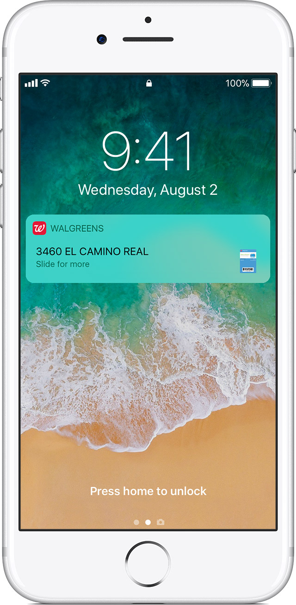

# Wallet

> With Wallet, you can use passes on your iPhone to check in for flights, get and redeem rewards, get in to movies, or redeem coupons. Passes can include useful information like the balance on your coffee card, your coupon’s expiration date, your seat number for a concert, and more. ~ Apple inc. (z.d.)

Om het gebruik van de QR code makkelijk en snel te houden is er gekozen om de optie aan te bieden de code toe te voegen aan je wallet[1]. Middels de code in deze apps op te slaan kan door middel van de gebruiker zijn locatie de code op het lockscherm worden getoond als de gebruiker in de buurt is van de club. Zo hoeft de gebruiker hier minder over na te denken en is functionaliteit snel beschikbaar.

[1] Op een android device kan de code opgeslagen worden in de [Google Pay](https://pay.google.com/about/) app als reward card.
