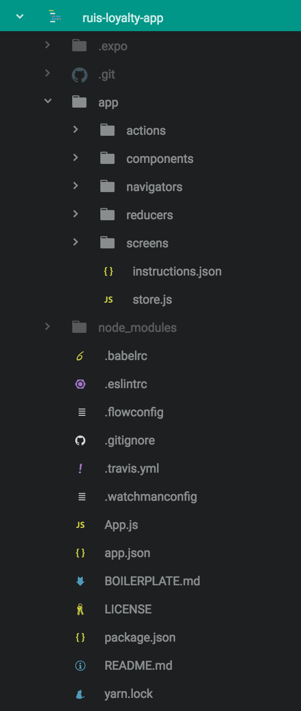

# React Native Prototype

Naast een [klikbaar prototype in sketch](https://sketch.cloud/s/5xWvE) heb ik een opzet gemaakt voor een prototype in React Native. Hierbij zijn een paar keuzes gemaakt bij het opzetten en de structuur van het project. De code voor dit prototype is te vinden op [GitHub](https://github.com/IanCStewart/ruis-loyalty-app).

## Folder structuur

De bovenste map bevat voornamelijk config files voor verscheidenen 'dependencies' en setup files voor de native app. Hier is `App.js` de file waarmee de app opgestart en geserved word. De rest van de logica van de app zit in de app folder. Hier worden de files onderverdeeld in actions, components, navigators, reducers en screens. In de screens folder staan de files de een bepaalde screen renderen. Deze files worden gezien als "slimme" componenten en worden geconnect met redux. De screens worden weer opgebouwd uit kleinere components die dus weer in hun eigen map plaats vinden. Deze files worden gezien als "domme" componenten en renderen één specefiek item. De componenten worden zo opgebouwd dat ze herbruikbaar zijn. Om de screens te kunnen renderen word er gebruik gemaakt van navigators. Deze files zorgen voor de navigatie tussen schermen en renderen het juiste scherm op het juiste moment. Naast al deze component folders zijn er nog twee folders die specefiek voor redux zijn. Dit zijn de reducers en de actions. De actions zijn functies die bijvoorbeeld middels een API call data ophalen en na nodige bewerkingen door stuurt naar een reducer om opgeslagen te worden. In de reducer functies word de data die binnenkomt opgeslagen in een object waar de data thuis hoort zodat de app hier weer gebruik van kan maken.

## Tech Stack
De tech stack bestaat uit React Native met Redux.

### React Native
> With React Native, you don't build a "mobile web app", an "HTML5 app", or a "hybrid app". You build a real mobile app that's indistinguishable from an app built using Objective-C or Java. React Native uses the same fundamental UI building blocks as regular iOS and Android apps. You just put those building blocks together using JavaScript and React. ~ Facebook (z.d.)

React Native is het framework waar alle JavaScript componenten worden geschreven. Dit framework is een abstractie laag boven op JavaScript om makkelijk UI componenten te maken en middels JavaScript een connectie maakt naar native code.

### Redux
> Redux is a state management tool for JavaScript applications. While it is frequently used with React, it is compatible with many other React-like frameworks such as Preact and Inferno as well as Angular and even just plain JavaScript. The main concept behind Redux is that the entire state of an application is stored in one central location. Each component of an application can have direct access to the state of the application without having to send props down to child components or using callback functions to send data back up to a parent. ~ Erikson, M. & Shoemaker, S. (z.d.)

Met Redux wordt de gehele state van de app bijgehouden. Zo kunnen componenten die niks met elkaar te maken hebben gebruik maken van dezelfde data. Hierbij wordt de Redux store de [single source of truth](https://medium.com/@juanguardado/redux-single-source-of-truth-e1fe1fb6ffec).
