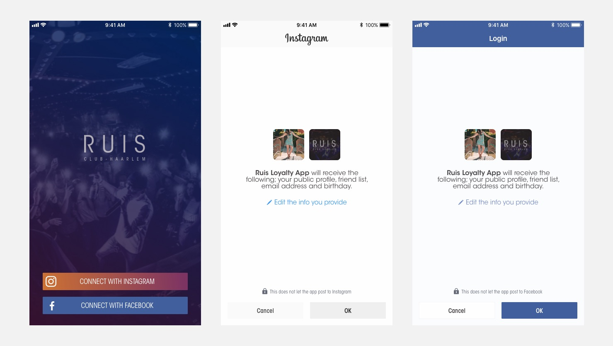

# Social Media Login/ Register

Voor het inloggen en registreren is er voor gekozen om middels social media een koppeling te maken. Deze keuze kwam voort uit zowel een behoefte van de doelgroep als de client.

## Doelgroep
> Requirement: `Snel bij functionaliteiten komen`

De doelgroep geeft tijdens de interviews aan dat zei liever geen lange formuleren in willen vullen om de app te kunnen gebruiken. Door het aanbieden van een social login zijn deze lange formulieren niet meer van toepassing. De gebruiker kan zo kiezen middels welke social media hij/ zij de app wilt koppelen en kan gelijk beginnen met het gebruiken van de app.

## Client
> Requirement: `Data over bezoekers`

De client geeft tijdens het eerste interview aan dat hij social media log in een goede manier vindt om authenticiteit van de gebruikers te waarborgen. Doormiddel van het koppellen van een social media account kost het maken van een nep account meer moeite waardoor dit minder vaak voor zal komen.

## Gekozen platforms
Ik heb er uiteindelijk voor gekozen om twee social media platforms aan te bieden als login/ register; Facebook & Instagram. In eerste instantie was er alleen de optie om via facebook in te loggen. Met de kijk op het laatste nieuws en het dalend aantal gebruikers van facebook heb ik er voor gekozen om gebruikers ook Instagram aan te bieden als platform.

> R. Soni (2017) concludeert: Not only can it enhance the user’s experience on your site – no need to fill out a registration form or remember yet more passwords – it also allows marketers to gather more accurate data, including verified email addresses, age, gender, relationship status and interests.
