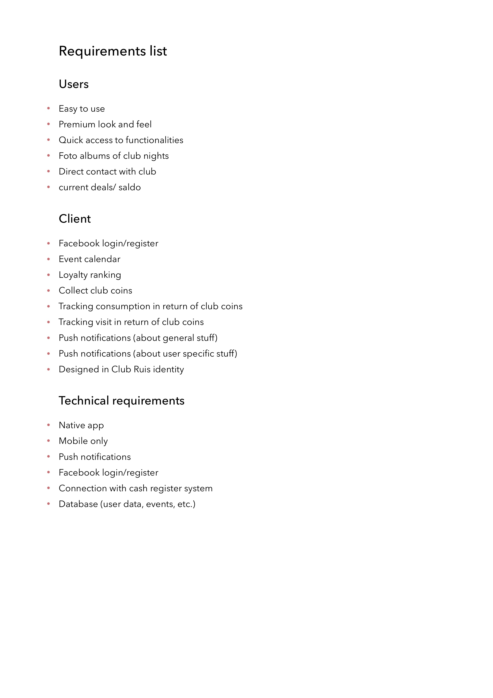

# Requirements List

## Opdrachtgever
Na een interview met de opdrachtgever kwam ik tot de volgende behoeftes:
- Brand loyalty
- Binding en digitale interactie met club gasten
- Meer traffic
- Data over bezoekers
- Werkend product (app)

## Gebruikers
Na een aantal interviews met de gasten kwam ik tot de volgende behoeftes:
- Makkelijk te gebruiken app
- Premium look & feel
- Snel bij functionaliteiten komen
- Foto albums kunnen bekijken
- Direct contact met de club (gevonden voorwerpen etc.)
- Huidige deals en eigen saldo
- Club agenda inzien

Tijdens de interviews waren dit belangrijkste punten die naar voren kwamen. Hieronder is de gehele lijst te zien. Hier is nog een uitbreiding te zien op technisch vlak. Deze is ook terug te vinden in mijn product biografie.

